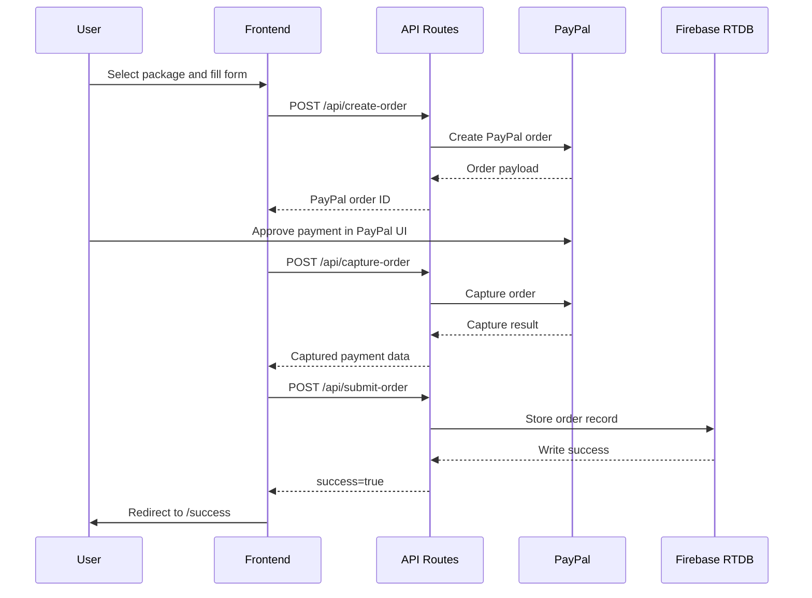

# System Flows

## 1. Public Browsing Flow

1. User lands on `/`
2. `public/home.html` presents the broader marketing site
3. User navigates to the YouTube promotion offer page at `/index.html`

## 2. Checkout Flow

1. User selects an amount on the package screen
2. UI calculates estimated viewer range from the selected amount
3. User advances to campaign details
4. User enters:
   - YouTube link
   - Optional full name
   - Email or phone
5. User reaches payment step
6. Client initializes PayPal buttons
7. Client calls `POST /api/create-order`
8. PayPal order ID is returned
9. After approval, client calls `POST /api/capture-order`
10. On successful capture, client calls `POST /api/submit-order`
11. Order record is stored in Firebase Realtime Database
12. User is redirected to `/success?order=...&amount=...`

## 3. Success Page Flow

1. Success page reads `order` and `amount` query params
2. If `amount` is present, it renders immediately
3. If `amount` is missing but `order` exists, page calls `GET /api/get-order?orderId=...`
4. Page displays confirmation and next-step messaging

## 4. Admin Flow

1. Admin opens `/admin`
2. Client loads Firebase web config
3. Admin signs in through Firebase Auth email/password
4. Dashboard calls `GET /api/get-orders`
5. Orders are rendered in a searchable/filterable table
6. Admin opens an order modal
7. Admin updates `serviceStatus` and `adminNotes`
8. Client writes those changes directly to Firebase Realtime Database from the browser

## Sequence Diagram

## State Model For Orders

There are two related status concepts in the order record:

- `status`
  Used when the order is first submitted. Defaults to `completed` in the checkout payload.

- `serviceStatus`
  Internal service-delivery status used by the admin dashboard:
  - `pending`
  - `in_progress`
  - `completed`
  - `cancelled`

This distinction should probably be simplified in a future revamp.
